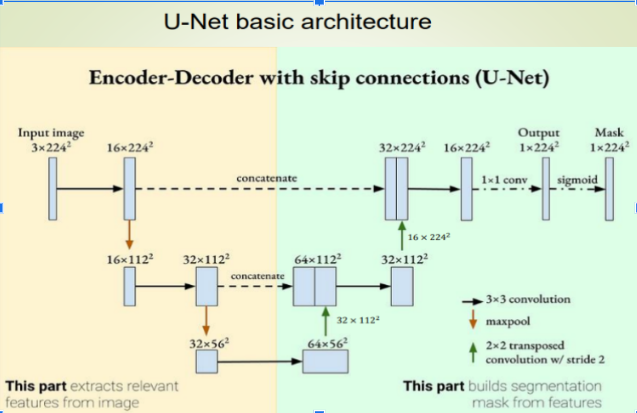
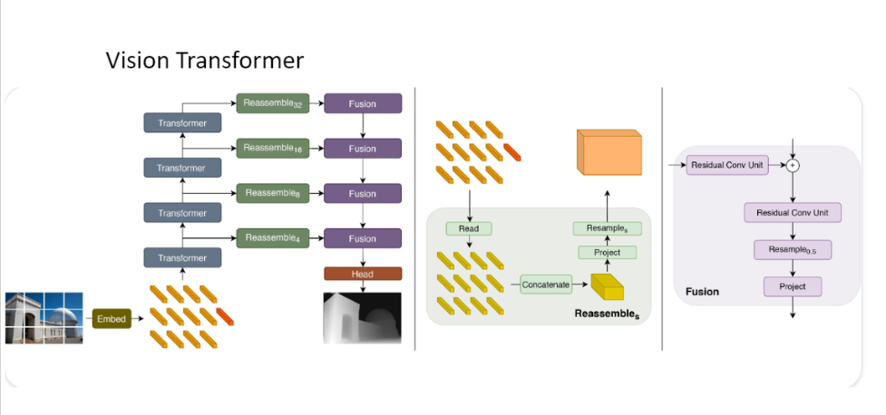
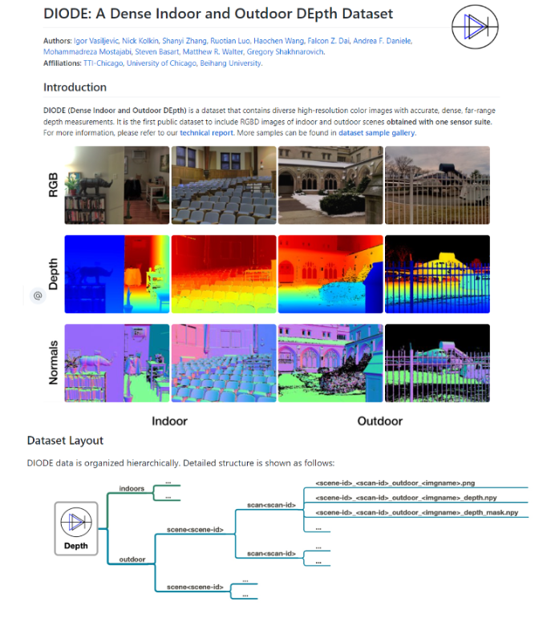

# Depth Estimation Models Comparison README

# Objective
The goal of this project is to train, assess, and compare various depth estimation models using different techniques. The objective is to generate depth estimation masks for input images. The models chosen for this project include:

Fully Convolutional Neural Network (U-net)
Generative Adversarial Network (pix2pix)
Vision Transformer
The comparison will be based on their performance, and to ensure a fair evaluation, consistent variables such as learning rate, batch size, and regularization parameters will be maintained across all models during training.

# Models
1. U-net

The U-net architecture is a fully convolutional neural network known for its success in semantic segmentation tasks. It will be fine-tuned for depth estimation on the given dataset.

2. pix2pix

Generative Adversarial Networks (GANs) have shown success in image-to-image translation tasks. Pix2pix is a GAN variant specifically designed for paired image translation problems. It will be adapted for depth estimation in this project.

3. Vision Transformer

Vision Transformers have gained popularity for their success in computer vision tasks. This model utilizes a transformer architecture, which has shown promising results in various domains. The Vision Transformer will be fine-tuned for depth estimation on the provided dataset.

#Dataset
https://diode-dataset.org/

